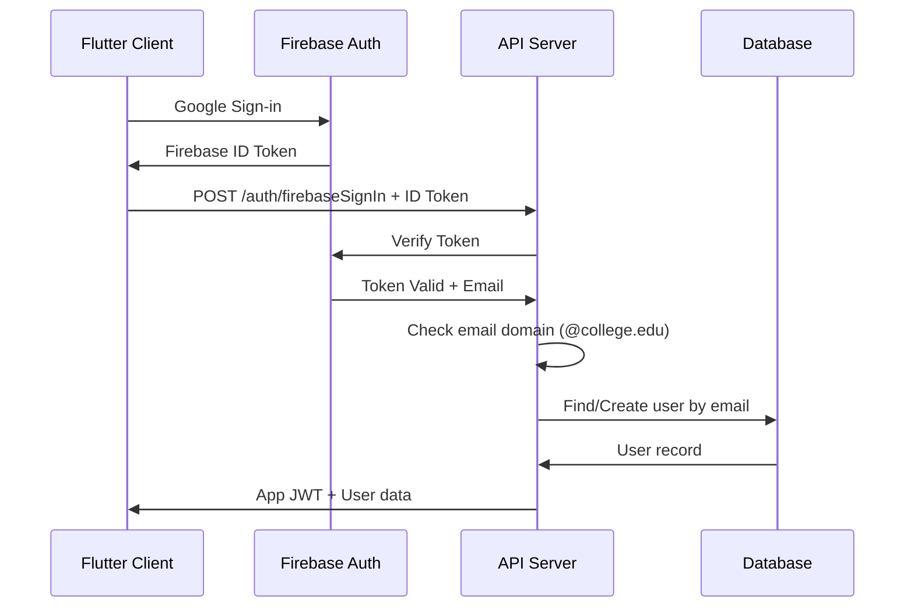
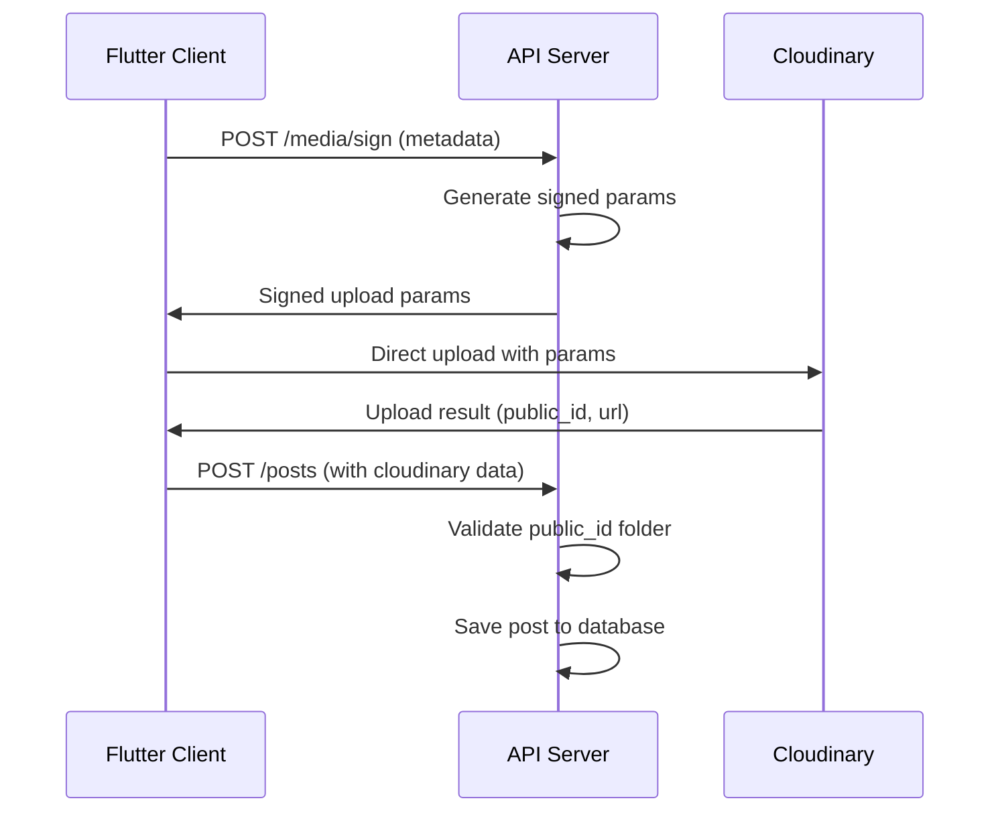
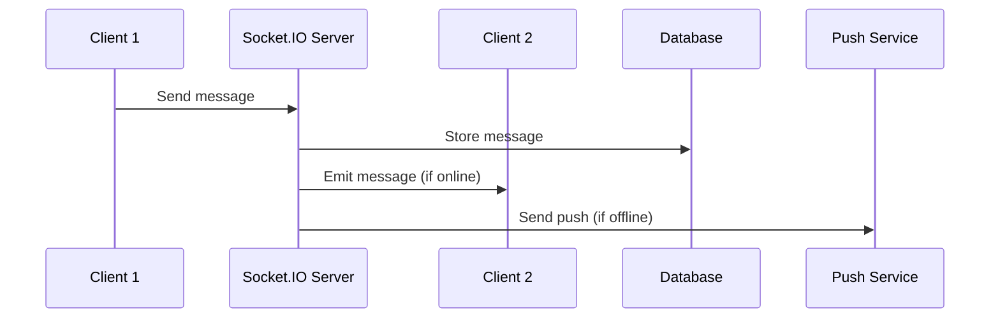

# Design Document

## Overview

The college social media application follows a modern microservices-inspired architecture with clear separation of concerns. The system consists of a Flutter cross-platform frontend, Node.js/Express backend API, MongoDB database, Firebase Authentication, Cloudinary media storage, and Socket.IO for real-time features. The architecture prioritizes security, scalability, and maintainability while ensuring college-only access through domain-restricted authentication.

## Architecture

### High-Level Architecture

```
┌─────────────────┐    ┌──────────────────┐    ┌─────────────────┐
│   Flutter App   │    │   Admin Web UI   │    │  Push Notifications │
│ (Android + Web) │    │   (React/Next)   │    │      (FCM)      │
└─────────┬───────┘    └────────┬─────────┘    └─────────────────┘
          │                     │                        │
          │ HTTPS/WSS          │ HTTPS                  │
          │                     │                        │
    ┌─────▼─────────────────────▼────────────────────────▼─────┐
    │                Node.js/Express API                      │
    │  ┌─────────────┐ ┌─────────────┐ ┌─────────────────────┐│
    │  │   Auth      │ │   Socket.IO │ │    Rate Limiting    ││
    │  │ Middleware  │ │   Server    │ │    & Security       ││
    │  └─────────────┘ └─────────────┘ └─────────────────────┘│
    └─────┬───────────────────┬─────────────────────┬─────────┘
          │                   │                     │
    ┌─────▼─────┐      ┌─────▼─────┐         ┌─────▼─────┐
    │ MongoDB   │      │ Firebase  │         │Cloudinary │
    │  Atlas    │      │   Auth    │         │  Storage  │
    └───────────┘      └───────────┘         └───────────┘
```

### Technology Stack

**Frontend:**

- Flutter 3.x with Dart
- Provider/Riverpod for state management
- firebase_auth for authentication
- socket_io_client for real-time features
- http package for API communication

**Backend:**

- Node.js with Express.js framework
- Mongoose ODM for MongoDB
- Socket.IO for real-time communication
- Firebase Admin SDK for token verification
- Cloudinary SDK for media management
- bcrypt for password hashing (if needed)
- helmet for security headers

**Database:**

- MongoDB Atlas (cloud) / MongoDB (local development)
- Redis (optional, for Socket.IO scaling)

**External Services:**

- Firebase Authentication
- Firebase Cloud Messaging (FCM)
- Cloudinary for media storage and transformation

## Components and Interfaces

### Authentication Flow



### Media Upload Flow



### Real-time Communication



## Data Models

### User Schema (Mongoose)

```javascript
const userSchema = new mongoose.Schema({
  studentId: { type: String, required: true, unique: true, immutable: true },
  email: { type: String, sparse: true, unique: true },
  displayName: { type: String, required: true },
  photoUrl: String,
  year: { type: Number, required: true, min: 1, max: 4 },
  department: { type: String, required: true },
  section: { type: String, required: true },
  bio: { type: String, maxlength: 500 },
  createdAt: { type: Date, default: Date.now },
  joinedAt: Date,
  badges: [String],
  fcmTokens: [String],
  settings: {
    notifications: { type: Boolean, default: true },
  },
});

// Indexes
userSchema.index({ studentId: 1 }, { unique: true });
userSchema.index({ email: 1 });
userSchema.index({ year: 1, department: 1, section: 1 });
```

### Post Schema

```javascript
const postSchema = new mongoose.Schema({
  authorStudentId: { type: String, required: true },
  type: { type: String, enum: ["image", "video", "text"], required: true },
  media: [
    {
      url: String,
      cloudinaryPublicId: String,
      width: Number,
      height: Number,
    },
  ],
  text: { type: String, maxlength: 2000 },
  visibility: {
    type: String,
    enum: ["public", "year", "dept", "section"],
    default: "public",
  },
  tags: [String],
  likesCount: { type: Number, default: 0 },
  commentsCount: { type: Number, default: 0 },
  createdAt: { type: Date, default: Date.now },
});

// Indexes
postSchema.index({ createdAt: -1 });
postSchema.index({ authorStudentId: 1 });
postSchema.index({ "$**": "text" }); // Text search
```

### Story Schema

```javascript
const storySchema = new mongoose.Schema({
  authorStudentId: { type: String, required: true },
  media: {
    url: { type: String, required: true },
    cloudinaryPublicId: { type: String, required: true },
    duration: Number,
  },
  createdAt: { type: Date, default: Date.now },
  expiresAt: {
    type: Date,
    default: () => new Date(Date.now() + 24 * 60 * 60 * 1000),
    expires: 0, // TTL index
  },
});
```

### Topic Schema

```javascript
const topicSchema = new mongoose.Schema({
  title: { type: String, required: true, maxlength: 200 },
  body: { type: String, required: true, maxlength: 5000 },
  authorStudentId: { type: String, required: true },
  votes: { type: Number, default: 0 },
  tags: [String],
  commentsCount: { type: Number, default: 0 },
  createdAt: { type: Date, default: Date.now },
});

// Indexes
topicSchema.index({ createdAt: -1 });
topicSchema.index({ votes: -1 });
topicSchema.index({ tags: 1 });
```

### Conversation and Message Schemas

```javascript
const conversationSchema = new mongoose.Schema({
  participants: [{ type: String, required: true }],
  lastMessage: String,
  updatedAt: { type: Date, default: Date.now },
});

const messageSchema = new mongoose.Schema({
  conversationId: { type: mongoose.Schema.Types.ObjectId, required: true },
  senderStudentId: { type: String, required: true },
  text: String,
  media: {
    url: String,
    cloudinaryPublicId: String,
  },
  createdAt: { type: Date, default: Date.now },
  readBy: [String],
});

// Indexes
conversationSchema.index({ participants: 1, updatedAt: -1 });
messageSchema.index({ conversationId: 1, createdAt: -1 });
```

### Notification Schema

```javascript
const notificationSchema = new mongoose.Schema({
  toStudentId: { type: String, required: true },
  type: {
    type: String,
    enum: ["like", "comment", "follow", "message", "topic"],
    required: true,
  },
  meta: {
    postId: mongoose.Schema.Types.ObjectId,
    fromStudentId: String,
    topicId: mongoose.Schema.Types.ObjectId,
  },
  isRead: { type: Boolean, default: false },
  createdAt: { type: Date, default: Date.now },
});

// Indexes
notificationSchema.index({ toStudentId: 1, createdAt: -1 });
```

## API Design

### Authentication Endpoints

```javascript
// POST /auth/firebaseSignIn
{
  "idToken": "firebase_id_token"
}
// Response: { "token": "app_jwt", "user": {...} }

// POST /auth/linkStudentId
{
  "studentId": "2025CS1001",
  "verificationCode": "123456"
}
```

### Content Endpoints

```javascript
// GET /posts?cursor=timestamp&filter=year:3&visibility=public
// POST /posts
{
  "type": "image",
  "text": "Caption text",
  "media": [{"url": "...", "cloudinaryPublicId": "..."}],
  "visibility": "public",
  "tags": ["campus", "event"]
}

// POST /posts/:id/like
// POST /posts/:id/comment
{
  "text": "Comment text"
}
```

### Media Endpoints

```javascript
// POST /media/sign
{
  "filename": "image.jpg",
  "mimeType": "image/jpeg",
  "studentId": "2025CS1001"
}
// Response: { "signature", "api_key", "timestamp", "folder" }
```

### Real-time Events (Socket.IO)

```javascript
// Client events
socket.emit("join_conversation", { conversationId });
socket.emit("send_message", { conversationId, text, media });
socket.emit("typing", { conversationId, isTyping });

// Server events
socket.on("message_received", { message, conversationId });
socket.on("user_typing", { studentId, conversationId, isTyping });
socket.on("notification", { type, meta, createdAt });
```

## Error Handling

### Error Response Format

```javascript
{
  "error": {
    "code": "INVALID_EMAIL_DOMAIN",
    "message": "Access denied: school-domain required",
    "details": {
      "providedDomain": "gmail.com",
      "requiredDomain": "college.edu"
    }
  }
}
```

### Error Categories

1. **Authentication Errors**

   - `INVALID_TOKEN`: Firebase token verification failed
   - `INVALID_EMAIL_DOMAIN`: Non-college email attempted sign-in
   - `STUDENT_ID_NOT_FOUND`: StudentId not in roster

2. **Validation Errors**

   - `INVALID_INPUT`: Request validation failed
   - `FILE_TOO_LARGE`: Media upload exceeds size limits
   - `INVALID_VISIBILITY`: Invalid post visibility setting

3. **Authorization Errors**

   - `INSUFFICIENT_PERMISSIONS`: User lacks required permissions
   - `RESOURCE_NOT_FOUND`: Requested resource doesn't exist
   - `RATE_LIMIT_EXCEEDED`: Too many requests

4. **System Errors**
   - `DATABASE_ERROR`: Database operation failed
   - `EXTERNAL_SERVICE_ERROR`: Third-party service unavailable
   - `INTERNAL_SERVER_ERROR`: Unexpected server error

## Testing Strategy

### Unit Testing

**Backend (Jest + Supertest)**

- Model validation and schema tests
- Authentication middleware tests
- API endpoint tests with mocked dependencies
- Cloudinary service integration tests
- Socket.IO event handler tests

**Frontend (Flutter Test)**

- Widget unit tests for UI components
- Service layer tests (API client, auth service)
- Provider/state management tests
- Model serialization/deserialization tests

### Integration Testing

**API Integration Tests**

- End-to-end authentication flow
- Media upload and post creation flow
- Real-time messaging flow
- Notification delivery flow

**Database Integration**

- MongoDB connection and query tests
- Index performance tests
- TTL expiration tests for stories

### End-to-End Testing

**Critical User Journeys**

1. Sign-in → Profile setup → Post creation → Feed viewing
2. Story creation → Story viewing → Auto-expiration
3. Topic creation → Voting → Commenting
4. Direct messaging → Real-time delivery → Push notifications
5. Admin roster upload → User account linking

### Performance Testing

**Load Testing Scenarios**

- Concurrent user sign-ins
- High-volume feed loading with pagination
- Real-time message delivery under load
- Media upload performance
- Database query performance with large datasets

### Security Testing

**Security Validation**

- Firebase token verification bypass attempts
- Email domain restriction bypass attempts
- Cloudinary folder access validation
- Rate limiting effectiveness
- SQL injection and NoSQL injection attempts
- Cross-site scripting (XSS) prevention

## Deployment Architecture

### Development Environment

```yaml
# docker-compose.yml structure
services:
  mongodb:
    image: mongo:6.0
    ports: ["27017:27017"]

  redis:
    image: redis:7-alpine
    ports: ["6379:6379"]

  api:
    build: ./backend
    ports: ["3000:3000"]
    environment:
      - NODE_ENV=development
      - MONGODB_URI=mongodb://mongodb:27017/college-app
```

### Production Considerations

**Scalability**

- Horizontal scaling with load balancers
- Redis cluster for Socket.IO scaling
- MongoDB Atlas with replica sets
- CDN for static assets

**Security**

- HTTPS enforcement
- Rate limiting with Redis
- Input validation and sanitization
- Regular security audits

**Monitoring**

- Application performance monitoring (APM)
- Error tracking and logging
- Database performance monitoring
- Real-time metrics dashboard

This design provides a solid foundation for implementing the college social media application with all required features while maintaining security, performance, and scalability.
